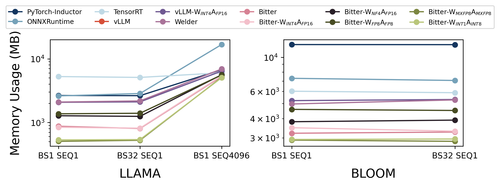
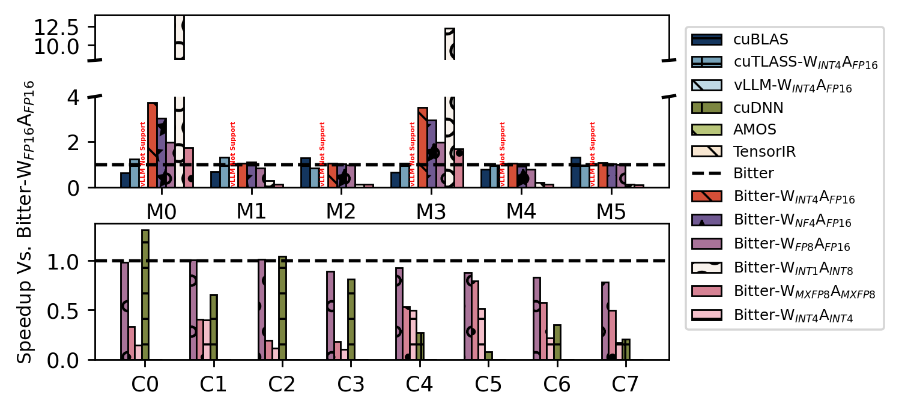

# OSDI'24 Ladder Artifact Evaluation for V100 GPU

## 0. Overview
This code branch is used for OSDI'24 Artifact Evaluation of paper #626, titled "Ladder: Enabling Efficient Low-Precision Deep Learning Computing through Hardware-aware Tensor Transformation".


* Artifacts Available:
    * All Ladder related code are available under Ladder open-source project located in: [https://github.com/microsoft/BitBLAS/tree/osdi24_ladder_artifact](https://github.com/microsoft/BitBLAS/tree/osdi24_ladder_artifact)
* Artifacts Functional:
    * *Documentation*: the following of documents include detailed guidelines on how to build, install, test Ladder and the experiments to compare with other baselines.
    * *Completeness*: the source code under `python/ladder` folder includes all the key components of Ladder.
    * *Exercisability*: under the *artifacts* folder, we prepare all the script and data to reproduce the experiements in individual folders named by the figure name in paper.
    * *Reuse for further research*: the single operator part of Ladder has been re-implemented and released as [BitBLAS](https://github.com/microsoft/BitBLAS), a library to support mixed-precision DNN operations. The end-to-end optimization part is available in this artifact.
* Results Reproduced:
    * To reproduce the main results presented in our paper, we provide Docker images containing all the environments and baseline software as we used in paper evaluation. We also provide detailed guideline to help reproduce the results step by step. 
    * Hardware requirements:
      * Require NVIDIA A100-80GB-PCIe GPU to reproduce the main results.
      * Require NVIDIA A100-80GB-PCIe GPU, NVIDIA Tesla V100-16GB-PCIe GPU, NVIDIA RTX A6000 GPU and AMD Instinct MI250 GPU to reproduce all the results.

## 1. Environment Preparation

### Prepare Docker Environment

To ease the process of installing all the dependencies, baseline software, and Ladder code, we provide a Dockerfile and a simple guideline to build a Docker image with all of above installed. The Docker image is built on top of Ubuntu 20.04, and it contains all the dependencies required to run the experiments. We only provide the Dockerfile for NVIDIA GPU, and the Dockerfile for AMD GPU will be provided upon request.

```bash
git clone --recursive https://github.com/microsoft/BitBLAS --branch osdi24_ladder_artifact Ladder
cd Ladder/docker
# build the image, this may take a while (around 30+ minutes on our test machine) as we install all benchmark frameworks 
docker build -t ladder_cuda_v100 -f Dockerfile.cu120 .
# run the container
nvidia-docker run -it --cap-add=SYS_ADMIN --network=host --gpus all --cap-add=SYS_PTRACE --shm-size=4G --security-opt seccomp=unconfined --security-opt apparmor=unconfined --name ladder_test_v100 ladder_cuda_v100 bash
# cd the artifact folder
cd /root/Ladder
```

### Prepare Model ONNX Files

We provide scripts in [artifact/models](https://github.com/microsoft/BitBLAS/tree/osdi24_ladder_artifact/artifact/models) to export the evaluated model in ONNX format with PyTorch.

```bash
cd /root/Ladder/artifact/models
bash export.sh
```

## 2. Reproducing Individual Experiement Results

Since ladder's paper evaluate different models with different batch-sizes and data-types, leading to more than 50 models to tune to completely reproduce the paper's result. To help reproduce quickly, we have uploaded all ladder's compiled model of V100 GPU at [Checkpoints_v100.zip](https://drive.google.com/file/d/1T7E_DbSCzosLmySG6L_N1roSNRgmDvoS/view?usp=sharing) or [Checkpoints_v100.tar.gz - Microsoft OneDrive](https://1drv.ms/u/c/4c1511b24254d525/EZKEEmxJ4D9IgUOQByaqaXsBhk5AUae9ne77uao3n_DSLw?e=bkvRdN)

To use the checkpoints, you can download the checkpoints and extract it to the root/artifact of the project.

```bash
cd /root/Ladder
# download from google drive
pip install gdown
gdown https://drive.google.com/uc?id=1I9kjtZnrBL2WfXwd2hOn1-AL5Snztx4W -O artifact/checkpoints.zip
apt install unzip
unzip artifact/checkpoints.zip
# or download from microsoft onedrive
curl https://my.microsoftpersonalcontent.com/personal/4c1511b24254d525/_layouts/15/download.aspx\?UniqueId\=f3342e8e-5cdb-4041-a2b5-32b6fdf5bb2d\&Translate\=false\&tempauth\=eyJhbGciOiJIUzI1NiIsInR5cCI6IkpXVCJ9.eyJhcHBfZGlzcGxheW5hbWUiOiJDb25zdW1lciBBcHA6IDAwMDAwMDAwLTAwMDAtMDAwMC0wMDAwLTAwMDA0ODE3MTBhNCIsImFwcGlkIjoiMDAwMDAwMDAtMDAwMC0wMDAwLTAwMDAtMDAwMDQ4MTcxMGE0IiwiYXVkIjoiMDAwMDAwMDMtMDAwMC0wZmYxLWNlMDAtMDAwMDAwMDAwMDAwL215Lm1pY3Jvc29mdHBlcnNvbmFsY29udGVudC5jb21AOTE4ODA0MGQtNmM2Ny00YzViLWIxMTItMzZhMzA0YjY2ZGFkIiwiY2FjaGVrZXkiOiIwaC5mfG1lbWJlcnNoaXB8MDAwM2JmZmQ1ZWVjZTU1MEBsaXZlLmNvbSIsImNpZCI6Im9TVzFLdnZBQUZCay8xckxPeWJ2RlE9PSIsImVuZHBvaW50dXJsIjoidGZDSmFoaE12MldyVExhOERxUTg0cVIwSnZZZmZRNTRjdDY0UXpxWEprUT0iLCJlbmRwb2ludHVybExlbmd0aCI6IjE1MyIsImV4cCI6IjE3MTQ5MjI3NjgiLCJpcGFkZHIiOiIxNjcuMjIwLjIzMi4yNSIsImlzbG9vcGJhY2siOiJUcnVlIiwiaXNzIjoiMDAwMDAwMDMtMDAwMC0wZmYxLWNlMDAtMDAwMDAwMDAwMDAwIiwibmJmIjoiMTcxNDkxOTE2OCIsInB1aWQiOiIwMDAzQkZGRDVFRUNFNTUwIiwic2NwIjoiYWxsc2l0ZXMuZnVsbGNvbnRyb2wiLCJzaWQiOiI1ODY0NDMzMzc4ODM5MDg3OTkxIiwic2l0ZWlkIjoiTURKalpqazFOV1V0WkRWbVpDMDBOalE1TFdKa05UQXROelUyTmprek1ESXpNV1ptIiwidGlkIjoiOTE4ODA0MGQtNmM2Ny00YzViLWIxMTItMzZhMzA0YjY2ZGFkIiwidHQiOiIyIiwidXBuIjoibGVpd2FuZzE5OTlAb3V0bG9vay5jb20iLCJ2ZXIiOiJoYXNoZWRwcm9vZnRva2VuIn0.PWbr-I0SJLbfKJYwzdiK3vxpx9infqFhV5kEGd-pXrM\&ApiVersion\=2.0\&AVOverride\=1   --output artifact/checkpoints.tar.gz
tar -xvf artifact/checkpoints.tar.gz -C .
```

After downloading, it should be extracted under the artifacts/temp folder. You can see a lot of model folders in it. With these pre-compiled models, results can be reproduced more quickly with a few commands. Here is a list of script we provide: -->

| Figure # in paper | Experiment Description                           | Commands                      | Script Location      |
| ----------------- | ------------------------------------------------ | ----------------------------- | ----------------------------- |
| Figure9   | End2End Performance on the NVIDIA V100 GPU               | [Figure9](#Figure9)           | [artifact/Figure9](https://github.com/microsoft/BitBLAS/tree/osdi24_ladder_artifact/artifact/Figure9)           |
| Figure11_V100  | Memory usage of LLM inference on the NVIDIA V100 GPU     | [Figure11](#figure11_v100)         | [artifact/Figure11_v100](https://github.com/microsoft/BitBLAS/tree/osdi24_ladder_artifact/artifact/Figure11_v100)         |
| Figure12_V100  | Operator Benchmark on the NVIDIA V100 GPU                | [Figure12](#figure12_v100)         | [artifact/Figure12_v100](https://github.com/microsoft/BitBLAS/tree/osdi24_ladder_artifact/artifact/Figure12_v100)         |
| Figure13_V100  | Optimization breakdown of LLAMA on the NVIDIA V100 GPU   | [Figure13](#figure13_v100)         | [artifact/Figure13_v100](https://github.com/microsoft/BitBLAS/tree/osdi24_ladder_artifact/artifact/Figure13_v100)         |
| Figure14_V100  | Scaling the bit width of weight and activation.          | [Figure14](#figure14_v100)         | [artifact/Figure14_v100](https://github.com/microsoft/BitBLAS/tree/osdi24_ladder_artifact/artifact/Figure14_v100)         |
| Table1    | MatMul Support and its Performance of Vendor Libraries   | [Table1](#Table1)             | [artifact/Table1](https://github.com/microsoft/BitBLAS/tree/osdi24_ladder_artifact/artifact/Table1)         |
| Table2    | Compilation time of AMOS, TensorIR Welder and Ladder     | [Table2](#Table2)             | [artifact/Table2](https://github.com/microsoft/BitBLAS/tree/osdi24_ladder_artifact/artifact/Table2)         |

### <a id="Figure9">Figure9</a>

**Device: NVIDIA V100-16GB-PCIe GPU**

The Figure 9 is about the end-to-end performance of the selected baselines and the proposed method. The end-to-end performance is measured by the inference time of the model. The inference time is measured in seconds.

Run the following command to generate the results of Figure 8:

```bash
cd /root/Ladder/artifact/Figure9
# draw figures with paper results
python3 run_all.py
mv png/* paper_result/
mv pdf/* paper_result/
# clean the reproduced logs
rm -rf reproduce_result/*
# ls reproduce_result
ls reproduce_result
# reproduce results and draw figures
python3 run_all.py --reproduce
# ls reproduce_result
ls reproduce_result
md5sum reproduce_result/*
mv png/* reproduce_result/
mv pdf/* reproduce_result/
```

The `run_all.py` script has the following options:

- `--reproduce`: bool, whether to reproduce the results, otherwise it will use our logges paper result, default value is `False`.
- `--force_tune_welder`: bool, whether to force tune the op with Welder, otherwise use the checkpoints if available, default value is `False`.
- `--force_tune_ladder`: bool, whether to force tune the op with Ladder, otherwise use the checkpoints if available, default value is `False`.
- `--force_tune_amos`: bool, whether to force tune the op with AMOS, otherwise use the checkpoints if available, default value is `False`.
- `--force_tune_tensorir`: bool, whether to force tune the op with TensorIR, otherwise use the checkpoints if available, default value is `False`.

The result will be saved in the `pdf` and `png` directory, respectively. For example, the reproduced result is:


**Notes**: The performance drop on $W_{INTx}A_{INTy}$ compared to A100 is because V100 only has tensor core support for $W_{FP16}A_{FP16}$ as shown in [Table1](#Table1). So $W_{INTx}A_{INTy}$ uses the cuda cores on V100, which is much slower than tensor core. Besides, $W_{MXFP8}A_{MXFP8}$ can only leverage $W_{FP32}A_{FP32}$ cuda core on V100 for processing, while it leverages $W_{BF16}A_{BF16}$ tensor core on A100, resulting in performance drop on V100.


### <a id="Figure11">Figure11_V100</a>

**Device: NVIDIA A100-80GB-PCIe GPU / V100-16GB-PCIe GPU**

Figure 11 provides a comparative analysis of memory usage across two machine learning models, LLAMA and BLOOM, using various inference frameworks and precision settings. The memory usage is measured in megabytes (MB) and is benchmarked across batch sizes and sequence lengths (BS1 SEQ1, BS32 SEQ1, BS1 SEQ4096).

Run the following command to generate the results of Figure 11:

```bash
python3 run_all.py
```

The `run_all.py` script has the following options:

- `--reproduce`: bool, whether to reproduce the results, otherwise it will use our logges paper result, default value is `False`.
- `--force_tune`: bool, whether to force tune the op with AMOS/TensorIR, otherwise use the checkpoints if available, default value is `False`.

The result will be saved in the `pdf` and `png` directory, respectively. For example, the reproduced result is:

**Notes**: Bloom with BS 4096 will occupy too much memory, so the execution will fail, so we do not provide the result of BS 4096 for Bloom.



#### Notes on Reproducing the Results

if your want to reproduce single settings, please check out:

```bash
python measure_memory.py --model llama --framework pytorch --batch_size 1 --seq_len 1
```

The output will be saved in the `log` directory. For example, the output of the above command is:

```
Measure the memory for llama batch 1 seq 1 under pytorch
{'llama_pytorch_1_1': 3872}
```

As we do not provide Welder Execute Binaries in our checkpoints (the Welder Execute Binaries are too big), so the scripts will first compile the welder binaries from onnx model, and then run the welder binaries to measure the memory usage. The compilation process may take a while.

### <a id="Figure12">Figure12_V100</a>

**Device: NVIDIA A100-80GB-PCIe GPU / V100-16GB-PCIe GPU**

Figure 12 showcases the performance speedup of various computational kernels across different models and configurations. The speedup is measured relative to the baseline performance Bitter-$W_{FP16}A_{FP16}$.

Run the following command to generate the results of Figure 12:

```bash
# use the paper result
python3 run_all.py
mv png/* paper_result/
mv pdf/* paper_result/
# clean the reproduced logs
rm -rf reproduce_result/*
# ls reproduce_result
ls reproduce_result
# reproduce results and draw figures
python3 run_all.py --reproduce
# ls reproduce_result
ls reproduce_result
md5sum reproduce_result/*
mv png/* reproduce_result/
mv pdf/* reproduce_result/
```

The `run_all.py` script has the following options:

- `--reproduce`: bool, whether to reproduce the results, otherwise it will use our logges paper result, default value is `False`.
- `--force_tune`: bool, whether to force tune the op with AMOS/TensorIR, otherwise use the checkpoints if available, default value is `False`.

The result will be saved in the `pdf` and `png` directory, respectively. For example, the reproduced result is:



**Notes**: For TensorIR Conv2d, we directly extract the operator performance form the end2end traces. So we do not provide the script to reproduce the result from single tensor ir expression. 

The performance drop on $W_{INTx}A_{INTy}$ compared to A100 is because V100 only has tensor core support for $W_{FP16}A_{FP16}$ as shown in [Table1](#Table1). So $W_{INTx}A_{INTy}$ uses the cuda cores on V100, which is much slower than tensor core.

### <a id="Figure13">Figure13_V100</a>

**Device: NVIDIA A100-80GB-PCIe GPU / V100-16GB-PCIe GPU**

Figure 13 illustrates the normalized speedup of various optimization techniques applied to two batch size sequences, BS1 SEQ1 and BS1 SEQ4096. It compares the performance of Welder-Roller, Transform, PTX, and Holistic Schedule optimizations against different computational precision configurations.

Run the following command to generate the results of Figure 13:

```bash
# use the paper result
python3 run_all.py
mv png/* paper_result/
mv pdf/* paper_result/
# clean the reproduced logs
rm -rf reproduce_result/*
# ls reproduce_result
ls reproduce_result
# reproduce results and draw figures
python3 run_all.py --reproduce
# ls reproduce_result
ls reproduce_result
md5sum reproduce_result/*
mv png/* reproduce_result/
mv pdf/* reproduce_result/
```

The `run_all.py` script has the following options:

- `--reproduce`: bool, whether to reproduce the results, otherwise it will use our logges paper result, default value is `False`.
- `--force_tune`: bool, whether to force tune the op with AMOS/TensorIR, otherwise use the checkpoints if available, default value is `False`.

The result will be saved in the `pdf` and `png` directory, respectively. For example, the reproduced result is:


### <a id="Figure14">Figure14_V100</a>

**Device: NVIDIA A100-80GB-PCIe GPU / V100-16GB-PCIe GPU**

Figure 14 depicts the end-to-end performance comparison of various baseline configurations against our proposed method across different models (M0 to M3) and batch size sequences (BS1 SEQ1 and BS1 SEQ4096). The performance metric is speedup, presented as a ratio over the baseline performance.

Run the following command to generate the results of Figure 14:

```bash
# use the paper result
python3 run_all.py
mv png/* paper_result/
mv pdf/* paper_result/
# clean the reproduced logs
rm -rf reproduce_result/*
# ls reproduce_result
ls reproduce_result
# reproduce results and draw figures
python3 run_all.py --reproduce
# ls reproduce_result
ls reproduce_result
md5sum reproduce_result/*
mv png/* reproduce_result/
mv pdf/* reproduce_result/
```

The `run_all.py` script has the following options:

- `--reproduce`: bool, whether to reproduce the results, otherwise it will use our logged paper result, default value is `False`.
- `--force_tune`: bool, whether to force tune the op with AMOS/TensorIR, otherwise use the checkpoints if available, default value is `False`.

The result will be saved in the `pdf` and `png` directory, respectively. For example, the reproduced result is:


**Notes**: The performance drop on $W_{INTx}A_{INTy}$ compared to A100 is because V100 only has tensor core support for $W_{FP16}A_{FP16}$ as shown in [Table1](#Table1). So $W_{INTx}A_{INTy}$ uses the cuda cores on V100, which is much slower than tensor core.

### <a id="Table1">Table1</a>

**Device: NVIDIA A100-80GB-PCIe GPU, NVIDIA V100-16GB-PCIe GPU, AMD Instinct MI250 GPU**

The Table1 is about the performance of the matrix multiplication of vendor libraries. The performance is measured by the throughput of the matrix multiplication. The throughput is calculated by the number of elements in the matrix divided by the time of the matrix multiplication. The throughput is measured in GFLOPS. 

The Table1 is generated by the following command:

```bash
# reproduce the results of Table1 on A100
cd nvidia
./run_all.sh A100
cd ..

# reproduce the results of Table1 on V100
cd nvidia
./run_all.sh V100
cd ..

# reproduce the results of Table1 on MI250
cd amd
./run_all.sh MI250
cd ..
```

The `run_all.sh` scripts share the following common options:

- `DEVICES`: str, the device to measure, default is `A100`.
- `USE_PAPER`: bool, whether to use the paper's result as the input, default is `True`.
- `FORCE_TUNE`: bool, whether to force tune the op with AMOS/TensorIR, otherwise use the checkpoints if available, default is `False`.

The example output of the Table1 is shown below:

```bash
+---------------------------------------------------------------------------------------------------+
|                                    Performance Overview - V100                                    |
+----------+----------------------+----------------------+--------------------+---------------------+
| Library  | W$_{FP16}$A$_{FP16}$ | W$_{INT8}$A$_{INT8}$ | W$_{FP8}$A$_{FP8}$ | W$_{NF4}$A$_{FP16}$ |
+----------+----------------------+----------------------+--------------------+---------------------+
|  cuBLAS  |         78%          |          x           |         x          |          x          |
| rocBLAS  |          x           |          x           |         x          |          x          |
|   AMOS   |         64%          |          x           |         x          |          x          |
| TensorIR |         67%          |          x           |         x          |          x          |
|  Roller  |         50%          |          x           |         x          |          x          |
+----------+----------------------+----------------------+--------------------+---------------------+
```

# Quick Start Guide for Model Inference and ONNX Export

This README provides a comprehensive guide to perform inference and ONNX export using different environments and precision settings. Follow the steps below to get started with inference using PyTorch in half precision, compilation and inference using Ladder with ONNX models, and inference with ONNX models containing quantized information.

## Prerequisites

Before beginning, ensure that you have set up the necessary environment variables and installed all required dependencies for the Ladder and AutoGPTQ frameworks. You should have Python installed on your system, along with PyTorch, ONNX, and other dependencies specified in the respective frameworks' documentation.

## Step 1: Inference Using PyTorch in Half Precision

1. Navigate to the directory containing the script `0.torch_inference_and_onnx_export.py`.
2. Run the following command to execute the script:
   ```bash
   python 0.torch_inference_and_onnx_export.py
   ```
   This script performs model inference in half precision (`torch.float16`) and outputs a tensor, such as:
   ```
   tensor([[[-0.7817,  0.9946, -0.1107,  ...,  1.9062,  1.5459,  0.8970]]],
       device='cuda:0', dtype=torch.float16)
   ```

## Step 2: Compile and Run ONNX Model Using Ladder

1. Set up environment variables for Ladder framework paths:
   ```bash
   export LADDER_HOME=$(pwd)/../../
   export LADDER_TVM_HOME=$LADDER_HOME/3rdparty/tvm
   export LADDER_CUTLASS_HOME=$LADDER_HOME/3rdparty/cutlass
   export PYTHONPATH=$LADDER_HOME/python:$LADDER_TVM_HOME/python:$PYTHONPATH
   export CPLUS_INCLUDE_PATH=$LADDER_CUTLASS_HOME/include
   ```
2. Compile the ONNX model using Ladder:
   ```bash
   python ladder_from_onnx.py --prefix ./llama2_70b_single_layer/model.onnx
   ```
   This may take several minutes. After compilation, the compiled model will be saved in `./progress/e2e/ladder_from_onnx`.
3. To run the compiled model, use:
   ```bash
   python ladder_from_onnx.py --prebuilt_path ./progress/e2e/ladder_from_onnx
   ```
   The output tensor will appear, such as:
   ```
   array([[[-0.7817 ,  0.9946 , -0.11066, ...,  1.906  ,  1.546  ,
          0.897  ]]]
   ```
4. To run the compressed model, use:
   ```bash
   python ladder_from_onnx_int4_compress.py  --prefix ./llama2_70b_single_layer/model.onnx --fast_decoding
   python ladder_from_onnx_int4_compress.py  --prebuilt_path ./progress/e2e/ladder_from_onnx_int4_compress
   ```
    The output tensor will appear, such as:
   ```
   array([[[-0.7817 ,  0.9946 , -0.11066, ...,  1.906  ,  1.546  ,
          0.897  ]]]
   ```
